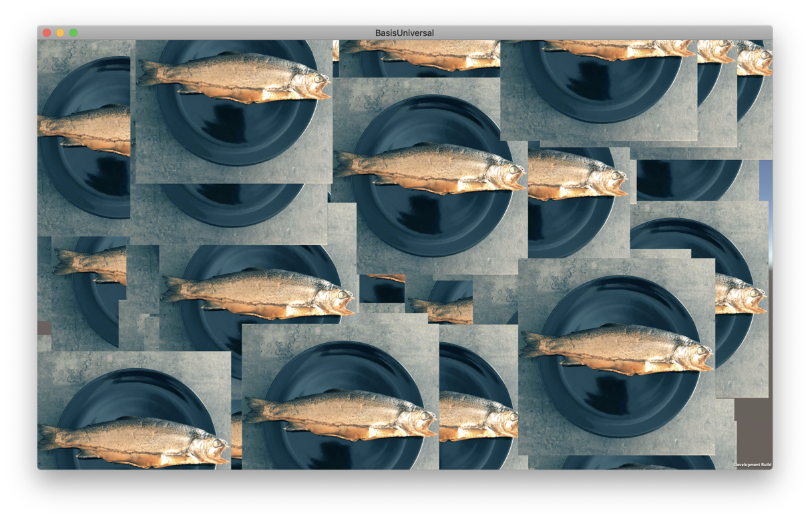

# KTX for Unity

<p align="center">

</p>

Unity package that allows users to load [KTX&trade; 2.0][ktx] or [Basis Universal][basisu] texture files.

## Features

- [KTX 2.0][ktx] files (.ktx2)
- [Basis Universal][basisu] files (.basis)
- ETC1s and UASTC mode for Basis Universal super compression
- Arbitrary Texture orientation can be considered

Following build targets are supported

- WebGL
- iOS (arm64 and armv7a)
- tvOS
- Android
- Windows (64 bit)
- Universal Windows Platform (x64,x86,ARM,ARM64)
- macOS Universal (Apple Silicon and Intel)
- Linux (64 bit)
- Lumin / Magic Leap
- Embedded Linux



## Installing

To install *KTX for Unity* package, follow these steps:

In your Unity project, go to Windows > Package Manager.
On the status bar, select the Add (+) button.
From the Add menu, select Add + package by name. Name and Version fields appear.
In the Name field, enter `com.unity.cloud.ktx`.
Select Add.
The Editor installs the latest available version of the package and any dependent packages.

> **NOTE:** This package originally had the identifier `com.atteneder.ktx`. Consult the [upgrade guide](./Documentation~/upgrade-guide.md#unity-fork) to learn how to switch to the Unity version (`com.unity.cloud.ktx`) or [install the original package](./Documentation~/Original.md).

## Using

The API provides the loading classes `KtxTexture` for KTX 2.0 files and `BasisUniversalTexture` for Basis files, which both offer the following async loading methods:

- `LoadFromUrl` for loading URLs (including file URLs starting with `file://`)
- `LoadFromStreamingAssets` for loading relative paths in the StreamingAssets folder
- `LoadFromBytes` for loading from memory

See [TextureBase](./Runtime/Scripts/TextureBase.cs) for complete signature.

### Loading Textures

How to load a file (for example from StreamingAssets):

```C#
…
async void Start() {

    // Create KTX texture instance
    var texture = new KtxTexture();

    // Linear color sampling. Needed for non-color value textures (e.g. normal maps)
    bool linearColor = true;

    // Load file from Streaming Assets folder (relative path)
    var result = await texture.LoadFromStreamingAssets("trout.ktx",linearColor);

    // Alternative: Load from URL
    // var result = await texture.LoadFromUrl("https://myserver.com/trout.ktx", linearColor);

    // Alternative: Load from memory
    // var result = await texture.LoadFromBytes(nativeArray, linearColor);

    if (result != null) {
        // Use texture. For example, apply texture to a material
        targetMaterial.mainTexture = result.texture;

        // Optional: Support arbitrary texture orientation by flipping the texture if necessary
        var scale = targetMaterial.mainTextureScale;
        scale.x = result.orientation.IsXFlipped() ? -1 : 1;
        scale.y = result.orientation.IsYFlipped() ? -1 : 1;
        targetMaterial.mainTextureScale = scale;
    }
}
…
```

### Using as Sprite

If you want to use the texture in a UI / Sprite context, this is how you create a Sprite with correct orientation:

```C#
…
async void Start() {

    // Create a basis universal texture instance
    var texture = new BasisUniversalTexture();

    // Load file from Streaming Assets folder
    var result = await texture.LoadFromStreamingAssets("dachstein.basis");

    if (result != null) {
        // Calculate correct size
        var pos = new Vector2(0,0);
        var size = new Vector2(result.texture.width, result.texture.height);

        // Flip Sprite, if required
        if(result.orientation.IsXFlipped()) {
            pos.x = size.x;
            size.x *= -1;
        }

        if(result.orientation.IsYFlipped()) {
            pos.y = size.y;
            size.y *= -1;
        }

        // Create a Sprite and assign it to the Image
        GetComponent<Image>().sprite = Sprite.Create(result.texture, new Rect(pos, size), Vector2.zero);

        // Preserve aspect ratio:
        // Flipping the sprite by making the size x or y negative (above) breaks Image's `Preserve Aspect` feature
        // You can/have to calculate the RectTransform size yourself. Example:

        // Calculate correct size and assign it to the RectTransform
        const float scale = 0.5f; // Set this to whatever size you need it - best make it a serialized class field
        var rt = GetComponent<RectTransform>();
        rt.sizeDelta = new Vector2(result.texture.width*scale, result.texture.height*scale);
    }
}
…
```

> Note: You can still use the `Preserve Aspect` Image option, if you encode your KTX/Basis files with flipped Y axis (see [Creating Textures](#creating-textures) )

### Advanced

Developers who want to create advanced loading code should look into classes `KtxTexture`/`BasisUniversalTexture` and `TextureBase` directly.

When loading many textures at once, using the low-level API to get finer control over the loading process can yield great performance gains. Have a look at `TextureBase.Load` and for starting and details.

## Creating Textures

You can use the command line tools `toktx` (comes with [KTX-Software][ktxsoftware]) to create KTX v2.0 files and `basisu` (part of [Basis Universal](https://github.com/BinomialLLC/basis_universal)) to create .basis files.

The default texture orientation of both of those tools (right-down) does not match Unity's orientation (right-up). To counter-act, you can provide a parameter to flip textures in the vertical axis (Y). This is recommended, if you use the textures in Unity only. The parameters are:

- `--lower_left_maps_to_s0t0` for `toktx`
- `--y_flip` for `basisu`

Example usage:

```bash
# For KTX files:
# Create regular KTX file from an input image
toktx --bcmp regular.ktx2 input.png
# Create a y-flipped KTX file, fit for Unity out of the box
toktx --lower_left_maps_to_s0t0 --bcmp unity_flipped.ktx2 input.png


# For Basis files:
# Create regular basis file from an input image
basisu -output_file regular.basis input.png
# Create a y-flipped basis file, fit for Unity out of the box
basisu -y_flip -output_file unity_flipped.basis input.png
```

If changing the orientation of your texture files is not an option, you can correct it by applying it flipped at run-time (see [Using](#using)).

## Limitations

At the moment known shortcomings:

- KTX with non-supercompressed formats (like uncompressed, DXT, BC7, PVRTC, ETC, … ) are not tested or supported
- Only 2D image texture types (no cube-map, videos, 3D texture, 2D arrays)
- Only RGB/RGBA is tested (RG,R untested)

## Trademarks

*Unity* is a registered trademark of [Unity Technologies][unity].

Khronos&reg; and the Khronos Group logo are registered trademarks of the [The Khronos Group Inc][khronos].

KTX&trade; and the KTX logo are trademarks of the [The Khronos Group Inc][khronos].

## License

Copyright 2023 Unity Technologies and the *KTX for Unity* authors

Licensed under the Apache License, Version 2.0 (the "License");
you may not use files in this repository except in compliance with the License.
You may obtain a copy of the License at

   <http://www.apache.org/licenses/LICENSE-2.0>

Unless required by applicable law or agreed to in writing, software
distributed under the License is distributed on an "AS IS" BASIS,
WITHOUT WARRANTIES OR CONDITIONS OF ANY KIND, either express or implied.
See the License for the specific language governing permissions and
limitations under the License.

[basisu]: https://github.com/BinomialLLC/basis_universal
[binomial]: http://www.binomial.info
[khronos]: https://www.khronos.org
[kofi]: https://ko-fi.com/C0C3BW7G
[ktx]: https://www.khronos.org/ktx/
[ktxsoftware]: https://github.com/KhronosGroup/KTX-Software
[unity]: https://unity.com
